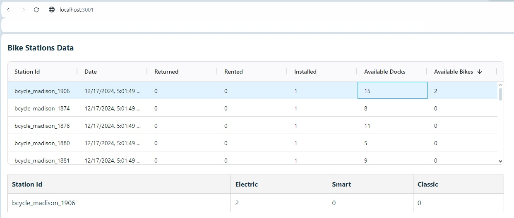

# Bike Stations Data Grids

## Screenshot

## Description
The Grids show data pulled from feed provided
The top grid shows general information for each bike station:
* Station Id
* Date the data was created
* The number of bikes:
    * Returned
    * Rented
    * Installed
* The number of available docks
* The number of available bikes

The bottom Grid shows information related to te available bikes for each bike station:
* Station Id
* Number of the different kinds of bikes that are available
    * Electric
    * Smart
    * Classic

## Dependencies

* Docker and Git are assumed to be installed. 
    * https://www.docker.com/get-started/
    * https://git-scm.com/downloads

## Installing

From the command line (Terminal):
1. Clone the repository (git clone https://github.com/davidhcmex/movatic-stations.git)
1. Move to the directory (cd movatic-stations)
2. Run 'docker-compose up --build'

## Executing program

1. On a WEB browser run:
* localhost:3001/

2. To terminate:
* CTR-C on the Terminal that is running 'docker-compose up' process

## Instructions Of Operation
* Operation is straightforward, in the initial state only the top grid shows up, as soon as the user clicks on a row of the grid,
the bottom grid shows up with the corresponding details. Clicking on another row of the top grid will
update information on the bottom grid

## Some Technical Info
* As required, the data is served from a Python REST Api endpoint (/api/stations-data)
* There is another simple Node REST Api endpoint with the same name (/api/stations-data), it is
defined on .\movatic-ts\index.js and is the one that makes the GET request to the Python one
* The Node enpoint is requested from .\movatic-ts\src\components\Dashboard.tsx
* Another important function in .\movatic-ts\index.js is to serve the static file generated by the
build command in Dockerfile
* The application relies mainly on the following libraries:

    On the Frontend (React+Typescript)
    * React Redux and React Redux Toolkit (for state management)
    * Ag-grid (for the top grid, the bottom grid is built with HTML Table tag and other related tags)
    * Express (for the Node REST Api)

    On the Backend (Python)
    * Flask
    * Requests

